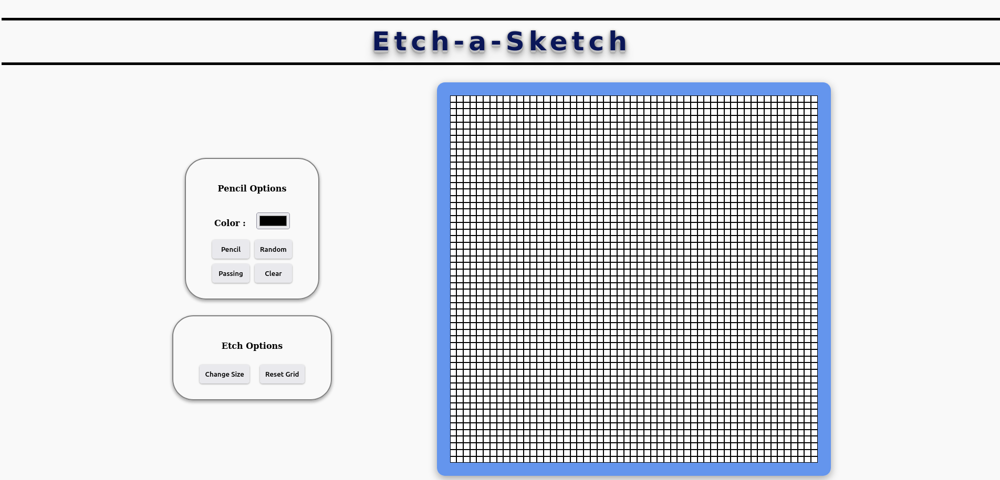

# Etch-a-Sketch

This project was made with HTML/CSS and JavaScript.

With availability to offer an Etch-a-Sketch with 55 squares it is possible:
 - Choose any color
- Choose color completely randomly
- Delete the area determined by the user or simply reset everything
- Change layout at any time

